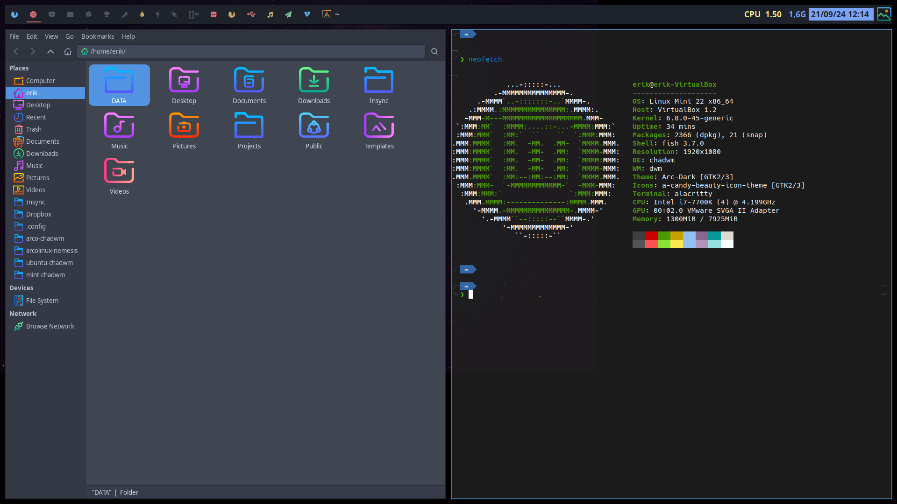
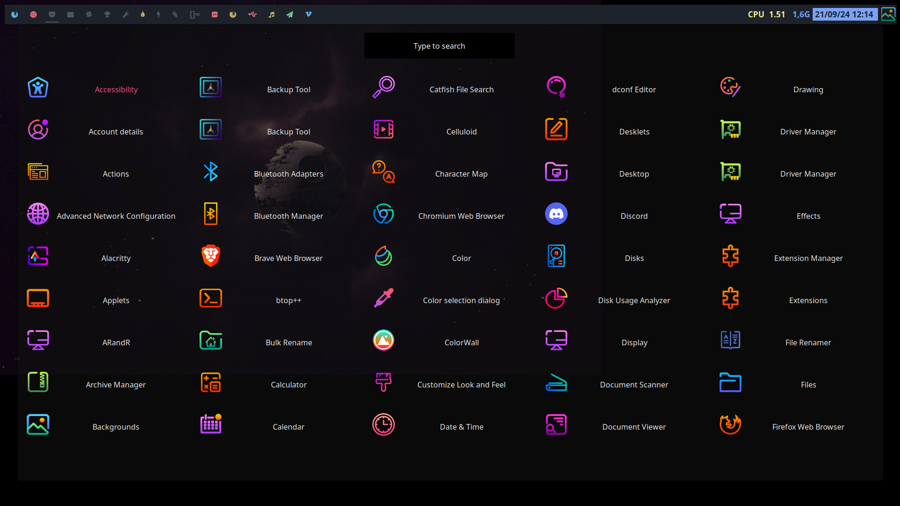
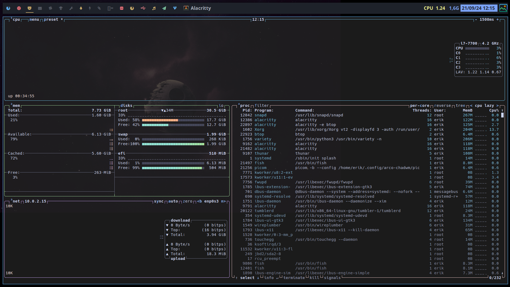
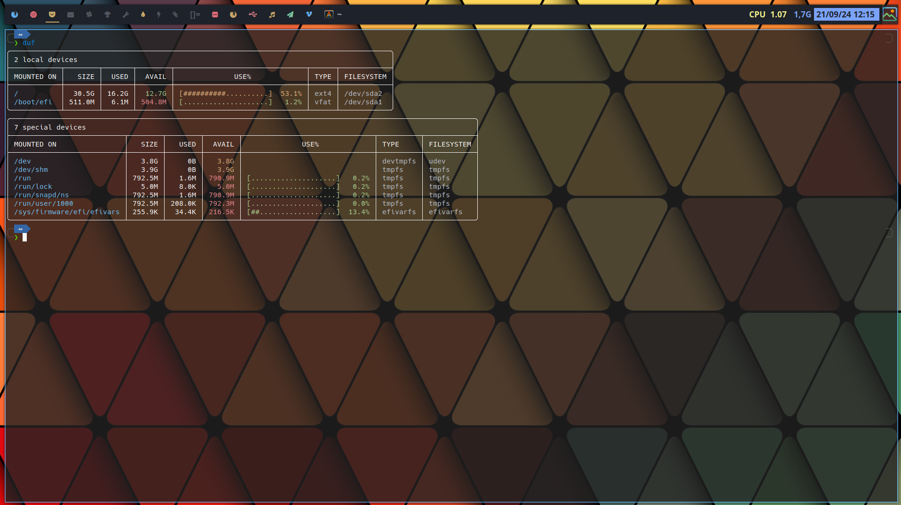
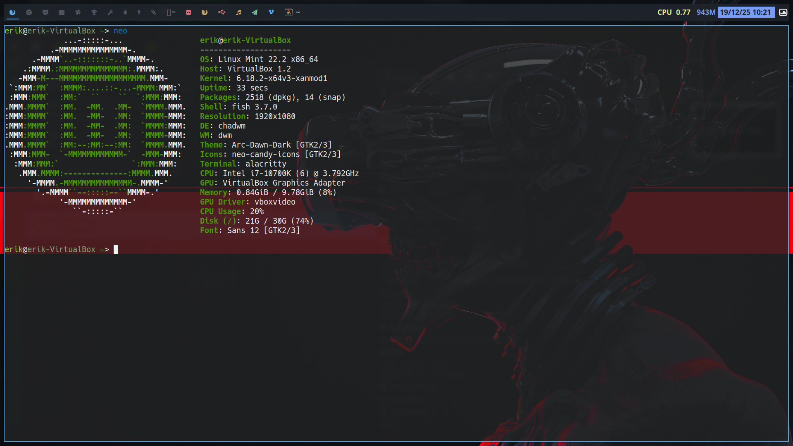

<h1 align="center">
 
   
   Linux Mint Chadwm
</h1>

# Chadwm is a fork from Dwm

At ArcoLinux we created our own take on this TWM. That is what we will install on any Linux Mint and so many things more.
Until it is quite perfect for our use.

# CODE

The code can be found as part of ArcoLinux Nemesis here:

https://github.com/erikdubois/arcolinux-nemesis/tree/master/Personal/settings/voyage-of-chadwm/mint-chadwm

Type in a terminal

0-current-choices.sh

and it will run the scripts. Decide what to run is also an option ofcourse.

# Youtube

Watch the videos 

https://www.youtube.com/playlist?list=PLlloYVGq5pS4dMHsRIx6RAfbLNNMOEdCM

# Examples

Build the Xanmod kernel in this one

